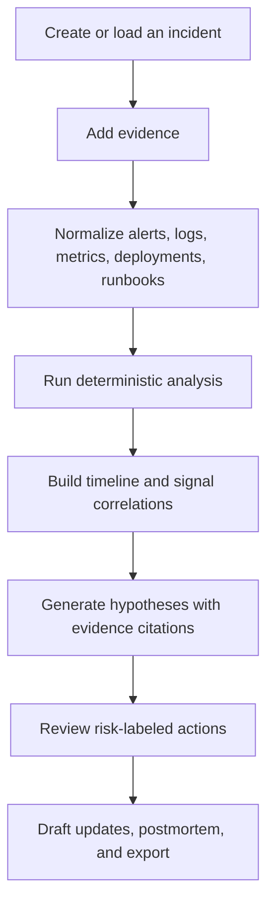
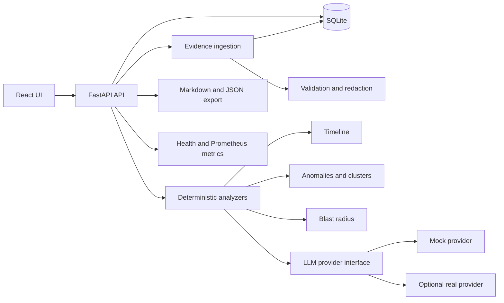
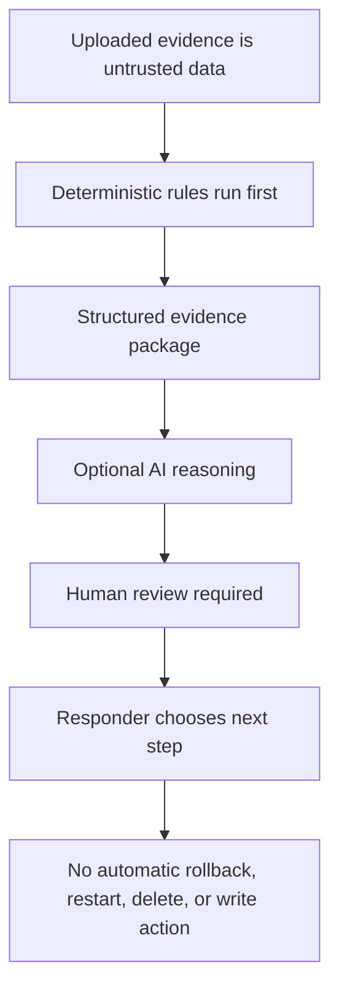

# AI Incident Investigator


AI Incident Investigator is a local web app for SREs and platform teams.

It helps a responder collect incident evidence, build a timeline, compare signals, and write a clear investigation report. The goal is simple: help humans reason through production incidents without turning the tool into a risky auto-remediation bot.

## What It Does

- Ingests alerts, logs, metrics, deployments, service maps, runbooks, and notes
- Builds a timeline from timestamped evidence
- Finds basic metric anomalies and repeated log patterns
- Shows recent deployments without blaming them by default
- Estimates blast radius from service dependencies
- Produces ranked hypotheses with evidence IDs
- Suggests diagnostic steps and mitigations with risk labels
- Drafts incident updates and a postmortem
- Exports the report as Markdown or JSON
- Runs without an LLM key using the mock provider

## Why This Exists

Most incident tools either show raw dashboards or summarize logs. This project tries to sit in the middle.

It keeps facts, hypotheses, and recommendations separate. Every important claim should point back to evidence such as `ALERT-001`, `LOG-002`, or `METRIC-003`.

## Investigation Flow



## System Shape



## Safety Model



## Quick Start

```bash
make setup
make backend-dev
```

In another terminal:

```bash
make frontend-dev
```

Open:

- Frontend: http://127.0.0.1:5173
- API docs: http://127.0.0.1:8000/docs

Load the DB latency demo, then click **Run investigation**.

## Docker

```bash
docker compose up --build
```

## Demo Scenarios

The repo includes two sample incidents:

- Database slowness causing downstream timeouts
- Memory leak after deployment

The memory leak scenario includes a malicious log line that tries to give instructions. The app keeps it as evidence, but does not treat it as an instruction.

## Tech Stack

- Backend: Python, FastAPI, Pydantic, SQLAlchemy, SQLite
- Frontend: React, TypeScript, Vite
- Testing: Pytest, Vitest, Playwright
- Tooling: Docker, Ruff, MyPy, ESLint, Prettier, GitHub Actions

## Useful Commands

```bash
make test
make lint
make typecheck
make docker-up
make docker-down
```

## What It Does Not Do

- It does not connect to real production systems in v1
- It does not execute commands or rollbacks
- It does not claim advanced machine learning
- It does not replace an incident commander or SRE judgment
- It does not include authentication or multi-tenancy yet

## License

MIT
